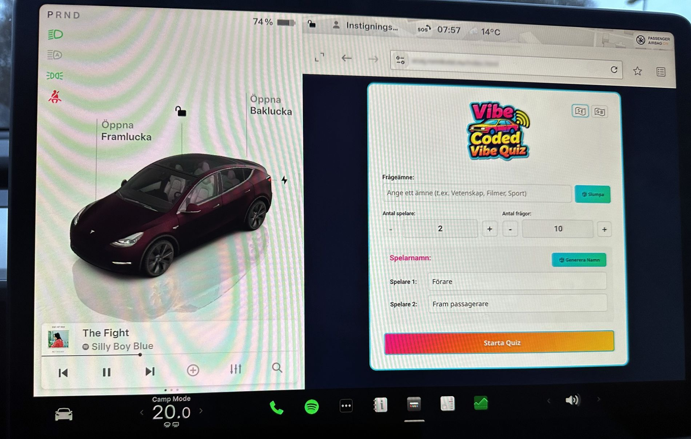

# 🎮 Vibe Coded Vibe Quiz (VCVQ)

[](https://www.bestpractices.dev/projects/11431)
[](https://scorecard.dev/viewer/?uri=github.com/rikardronnkvist/vcvq)
[](https://app.fossa.com/projects/git%2Bgithub.com%2Frikardronnkvist%2Fvcvq?ref=badge_shield&issueType=license)
[](https://app.fossa.com/projects/git%2Bgithub.com%2Frikardronnkvist%2Fvcvq?ref=badge_shield&issueType=security)

A real-time multiplayer quiz game designed for car trips! Generate AI-powered quiz questions on any topic and compete with 2-5 players using an intuitive drag-and-drop or click interface.

**Project home:** https://github.com/rikardronnkvist/vcvq

## 🚗 Live Demo in a Car


*VCVQ quiz application running live on a Tesla Model Y infotainment system*

## 📚 Documentation

Comprehensive documentation is available in the [`docs/`](docs/) folder:

- **[📖 Documentation Index](docs/)** - Complete documentation overview
- **[📥 Installation Guide](docs/installation.md)** - How to install and run VCVQ
- **[🎮 User Guide](docs/usage.md)** - How to play and use all features
- **[🔌 API Reference](docs/interface-reference.md)** - Complete API and interface documentation
- **[👨‍💻 Development Guide](docs/development.md)** - How to contribute and develop
- **[🧪 Testing Guide](docs/testing.md)** - Testing and fuzzing information
- **[🔒 Security Policy](SECURITY.md)** - How to report security vulnerabilities
- **[📝 Changelog](CHANGELOG.md)** - Version history and release notes

## Features

- 🚗 **Car-Friendly Design** - Perfect for road trips with easy drag-and-drop or click controls
- 🤖 **AI-Generated Questions** - Powered by Google Gemini to create quizzes on any topic
- 🎲 **Random Topics** - Get 15 AI-generated funny topics with one click, or enter your own
- 👥 **2-5 Players** - Multiplayer support with AI-generated or customizable player names
- 🌍 **Bilingual** - Support for Swedish and English with easy language switching
- 🎨 **Visual Feedback** - Color-coded players with real-time scoring and player badges on answers
- 📱 **Responsive** - Works on desktop and tablets (optimized for Tesla Model Y browser at 1180x919)
- 🔋 **Tesla Compatible** - Special compatibility fixes for Tesla browser dropdown menus
- 🐳 **Docker Ready** - Easy deployment with Docker and docker-compose
- 🎯 **AI Player Names** - Generate fun, context-aware player names based on topic and car positions
- ⚙️ **Customizable** - Choose 5-50 questions and 4-8 answer options per question
- 🔄 **Game Restart** - Restart games while preserving all settings and player names

## Quick Start

### Prerequisites

- Docker and docker-compose installed
- Google Gemini API key ([Get one here](https://makersuite.google.com/app/apikey))

### Installation

1. **Extract the project files**

2. **Create environment file:**
```bash
   cp .env.example .env
```

3. **Edit `.env` and add your Gemini API key:**
```env
   GEMINI_API_KEY=your_actual_api_key_here
   PORT=3030
   # Optional: For cross-origin requests, set ALLOWED_ORIGINS
   # ALLOWED_ORIGINS=http://example.com,https://another-domain.com
```

4. **Start the application:**
```bash
   docker-compose up -d
```

5. **Open your browser:**
http://localhost:3030


## How to Play

1. **Setup:** Select language, choose a topic (or get AI-generated random topics), configure players (2-5), questions (5-50), and answer options (4-8)
2. **Gameplay:** Players take turns answering questions via drag-and-drop or click, with real-time feedback and scoring
3. **Winning:** Highest score wins, with support for ties. Restart anytime with preserved settings

For detailed gameplay instructions, see the **[User Guide](docs/usage.md)**.

## Development

For development setup and contribution guidelines, see:
- **[Development Guide](docs/development.md)** - Complete development setup
- **[Contributing Guidelines](CONTRIBUTING.md)** - How to contribute
- **[Testing Guide](docs/testing.md)** - Running and writing tests

## Security Analysis with GitHub CodeQL

This repository includes GitHub CodeQL for automated security and code quality analysis. CodeQL runs automatically on pushes, pull requests, and on a weekly schedule.

### Enabling CodeQL

If you encounter an error stating that actions must be from repositories owned by your organization, you need to update your GitHub repository settings:

1. **Navigate to repository settings:**
   - Go to your repository on GitHub
   - Click on **Settings** → **Actions** → **General**

2. **Update Actions permissions:**
   - Under **Actions permissions**, select **"Allow all actions and reusable workflows"**
   - Click **Save**

### Alternative: Fork Actions (If Keeping Restrictions)

If you prefer to keep restrictions on external actions, you can fork the required action repositories into your organization:

1. **Fork these repositories:**
   - [`actions/checkout`](https://github.com/actions/checkout)
   - [`github/codeql-action`](https://github.com/github/codeql-action)
   - [`actions/setup-node`](https://github.com/actions/setup-node)

2. **Update workflow file:**
   - Edit `.github/workflows/codeql-analysis.yml`
   - Replace `actions/checkout@v4` with `your-org/checkout@v4`
   - Replace `github/codeql-action/init@v3` with `your-org/codeql-action/init@v3`
   - Replace `actions/setup-node@v4` with `your-org/setup-node@v4`
   - Replace `github/codeql-action/analyze@v3` with `your-org/codeql-action/analyze@v3`

After enabling CodeQL, you'll see security analysis results in:
- The **Security** tab of your repository
- Pull request checks
- Automated weekly reports

## Security Features

VCVQ implements comprehensive security measures:

- **Security Headers:** Helmet middleware provides security headers including CSP, X-Frame-Options, and more
- **CORS Protection:** Configurable CORS with secure defaults (allows localhost, requires ALLOWED_ORIGINS for cross-origin)
- **Rate Limiting:** API endpoints are rate-limited to prevent abuse
- **Input Validation:** Server-side validation using express-validator
- **XSS Protection:** HTML escaping for all user-controlled and AI-generated content
- **Prompt Injection Prevention:** Sanitization of user inputs in AI prompts
- **JSON Parsing Error Handling:** Prevents server crashes from malformed responses
- **Docker Security:** Non-root user, security options, resource limits
- **Fuzzing:** Property-based testing with fast-check to detect vulnerabilities through automated testing with random and malicious inputs

For detailed security information, see **[SECURITY.md](SECURITY.md)** and the **[Testing Guide](docs/testing.md)**.

## Development Assistance

VCVQ includes AI-powered development assistance through the `prompts/` directory. See the **[Development Guide](docs/development.md)** for details on using the `/vibe` command and project-specific prompts.

## Technology Stack

- **Backend:** Node.js, Express 5.x
- **AI:** Google Gemini API (with automatic fallback: gemini-2.5-flash → gemini-2.0-flash → gemini-flash-latest → gemini-2.5-pro → gemini-pro-latest)
- **Frontend:** Vanilla JavaScript, HTML5, CSS3
- **Features:** HTML5 Drag and Drop API, Internationalization (i18n)
- **Security:** Helmet (security headers), CORS, express-rate-limit, express-validator
- **Testing:** fast-check (property-based fuzzing), Node.js test runner
- **Deployment:** Docker, docker-compose

## API Endpoints

- `POST /api/generate-quiz` - Generate quiz questions
- `POST /api/generate-player-names` - Generate AI player names
- `POST /api/generate-topic` - Generate random funny topics
- `POST /api/log-client-info` - Log client information
- `GET /health` - Health check endpoint

All endpoints include rate limiting, input validation, and security headers. See the **[API Reference](docs/interface-reference.md)** for complete documentation.

## Testing

VCVQ includes comprehensive testing with property-based fuzzing for security:

```bash
npm test                    # Run all tests
npm run test:fuzz           # Run fuzz tests only
npm run test:fuzz:verbose   # Verbose output
```

For detailed testing information, see the **[Testing Guide](docs/testing.md)**.

## Environment Variables

- `GEMINI_API_KEY` (required) - Your Google Gemini API key
- `PORT` (optional) - Server port, defaults to 3030
- `NODE_ENV` (optional) - Environment mode (development/production), defaults to production in Docker
- `ALLOWED_ORIGINS` (optional) - Comma-separated list of allowed CORS origins for cross-origin requests. If not set, only localhost and same-origin requests are allowed.

## License

MIT License - Feel free to use and modify!

## Credits

Created by the Vibe Coded team 🚀
